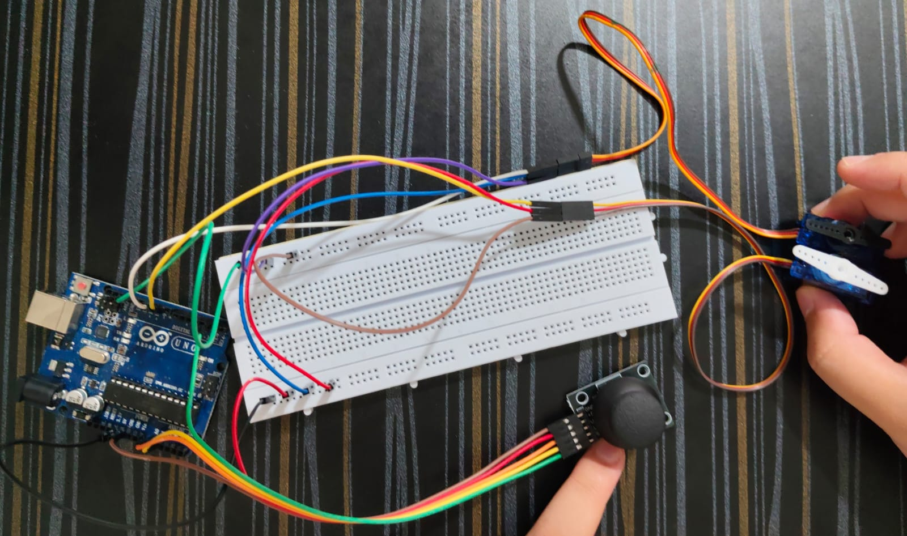

# Joystick Dual-Servo Control

An Arduino Uno project where a 2-axis joystick controls two servo motors (black and white) in real time with live serial feedback.

## 🎥 Demo
[▶️ Click here to watch the Demo Video](https://raw.githubusercontent.com/pranav-478/joystick-servo-control/main/joystick-2servo-demo-video.mp4)
## 🛠️ Components Used
- **Arduino Uno**
- **2-Axis Joystick Module**
- **2x Servo Motors (Black & White)**
- **Breadboard & Jumper Wires**

## 🚀 How It Works
1. Reads analog voltage signals (0–1023) from the joystick's X and Y axes.
2. Multiplies raw values by a scaling factor (`0.166`) to calculate corresponding servo angles (~0°–170°).
3. Writes the calculated angles directly to the black and white servos.
4. Outputs raw joystick readings and active servo angles to the Serial Monitor at 9600 baud.
